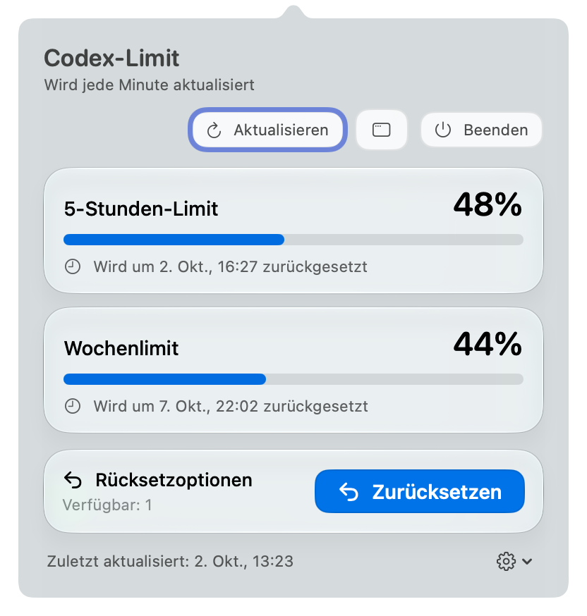
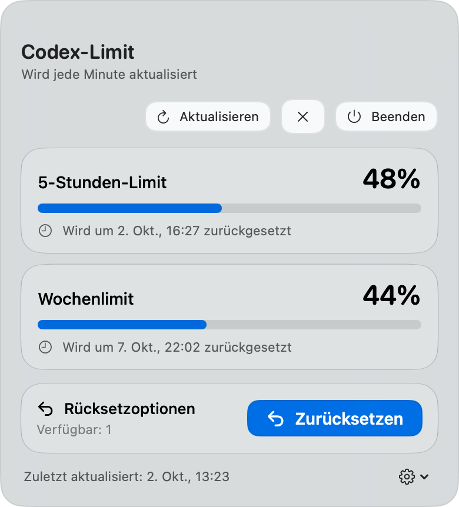

<p align="center"></p>

<h1 align="center">Codex-Limit für macOS</h1>
<p align="center">ChatGPT-Codex-Kontingente nahezu in Echtzeit verfolgen: automatisch jede Minute aktualisiert, jederzeit manuell aktualisierbar.</p>
<p align="center">  </p>

<p align="center">🇬🇧 <a href="README.md">English</a> · 🇨🇳 <a href="README.zh-CN.md">简体中文</a> · 🇨🇳 <a href="README.zh-TW.md">繁體中文</a> · 🇷🇺 <a href="README.ru.md">Русский</a> · 🇫🇷 <a href="README.fr.md">Français</a> · 🇩🇪 <a href="README.de.md">Deutsch</a> · 🇮🇹 <a href="README.it.md">Italiano</a> · 🇯🇵 <a href="README.ja.md">日本語</a> · 🇰🇷 <a href="README.ko.md">한국어</a> · 🇵🇹 <a href="README.pt.md">Português</a> · 🇪🇸 <a href="README.es.md">Español</a></p>

## Überblick

Eine schlanke Menüleisten-App für ChatGPT Codex. Prüfe verfügbare Nutzung, Rücksetzoptionen und Wiederherstellungszeiten, ohne deine Arbeit zu unterbrechen.

## Screenshots

| Menüleisten-Popover | Schwebendes Fenster |
| --- | --- |
|  |  |

Die App folgt den Spracheinstellungen von macOS.

## Hauptfunktionen

| Bereich | Funktionen |
| --- | --- |
| Menüleiste | Einfarbiger ChatGPT-Knoten: bei 100 % vollständig, bei sinkendem 5-Stunden-Limit von oben nach unten verblassend |
| App-Symbol | Weiße abgerundete Kachel mit ChatGPT-Knoten in Graphitgrau und einfarbiger Füllstandsanzeige |
| Limitstatus | Fortschrittsbalken für 5-Stunden- und Wochenlimits, Wiederherstellungszeiten und verfügbare Rücksetzungen |
| Fenster | Liquid-Glass-Menüleisten-Popover und separates, verschiebbares Fenster |
| Aktualisierung | Automatisch jede Minute; Bestätigung vor jeder Rücksetzung |
| Start | Ein optionaler lokaler Agent öffnet die App beim Start von ChatGPT |
| Sprachen | Englisch, vereinfachtes und traditionelles Chinesisch, Russisch, Französisch, Deutsch, Italienisch, Japanisch, Koreanisch, Portugiesisch und Spanisch |

## Installation

1. Installiere zuerst die ChatGPT-Desktop-App und melde dich an.
2. Lade [CodexQuota-macOS.zip](https://github.com/jcxl8/codex-quota-macos/releases/latest/download/CodexQuota-macOS.zip) herunter.
3. Doppelklicke im Finder auf die ZIP-Datei, um `CodexQuota.app` zu entpacken. Der Finder kann den lokalisierten App-Namen anzeigen.
4. Ziehe die entpackte App in den Finder-Ordner **Programme (Applications)**. **⌘⇧A** öffnet diesen Ordner. Installiere die App vor dem Start; öffne sie nicht direkt aus Downloads oder dem entpackten Ordner.
5. Öffne die App aus **Programme**. Symbol und Prozentwert erscheinen in der Menüleiste; ein fehlendes Dock-Symbol ist normal.
6. Optional: Öffne die **Einstellungen** der App und aktiviere **Beim Start von ChatGPT öffnen**.

Die App ist lokal signiert und nicht von Apple notarisiert. Falls macOS den ersten Start blockiert, öffne **Systemeinstellungen → Datenschutz & Sicherheit**, suche den Hinweis zur blockierten App und wähle **Dennoch öffnen**. Bestätige anschließend die Rückfrage. Verwende dies nur für die aus diesem Repository heruntergeladene App.

Erfordert macOS 13 oder neuer. Liquid Glass ist ab macOS 26 verfügbar; ältere Versionen verwenden das Systemmaterial.

### Installation über Terminal

Für die Erstinstallation auf einem Mac mit Apple Silicon diesen Block in Terminal einfügen. Er lädt Version 1.4.2 von GitHub Releases, prüft die SHA-256-Prüfsumme und installiert die App in Programme. Zuerst ChatGPT installieren und anmelden.

```sh
(
  set -eu
  app_target="/Applications/CodexQuota.app"
  if [ -e "$app_target" ] || [ -L "$app_target" ]; then
    printf '%s\n' 'Bereits installiert. App beenden und die alte Version anhand der Finder-Schritte oben ersetzen.' >&2
    exit 1
  fi
  download_dir="$(mktemp -d)"
  cd "$download_dir"
  curl -fL --retry 3 -O 'https://github.com/jcxl8/codex-quota-macos/releases/download/v1.4.2/CodexQuota-macOS.zip'
  curl -fL --retry 3 -O 'https://github.com/jcxl8/codex-quota-macos/releases/download/v1.4.2/CodexQuota-macOS.zip.sha256'
  shasum -a 256 -c CodexQuota-macOS.zip.sha256
  ditto -x -k CodexQuota-macOS.zip .
  ditto CodexQuota.app "$app_target"
  printf '%s\n' 'Installation abgeschlossen. CodexQuota.app aus Programme öffnen.'
)
```

Nach der Installation die App aus Programme öffnen. Die Sicherheitshinweise zum ersten Start oben gelten weiterhin. Dieses Paket unterstützt Apple Silicon (arm64), keine Intel-Macs.

## Build

Zum Bauen sind Xcode 26 oder neuer und dessen Icon-Composer-Compiler erforderlich. Erfordert macOS und Swift 5.9 oder neuer. Führe das enthaltene Build-Skript im Terminal aus, um die App zu erstellen und die integrierten Prüfungen auszuführen.

## Datenschutz

Die App liest Limitdaten über das mit der ChatGPT-Desktop-App gelieferte Codex CLI. Sie sammelt oder überträgt keine Daten, speichert keine Zugriffstoken und sendet keine Modellanfragen. Eine Rücksetzoption wird erst nach Auswahl und Bestätigung verbraucht. ChatGPT muss installiert sein und du musst angemeldet sein. Die App ist lokal signiert und nicht von Apple notariell beglaubigt.
