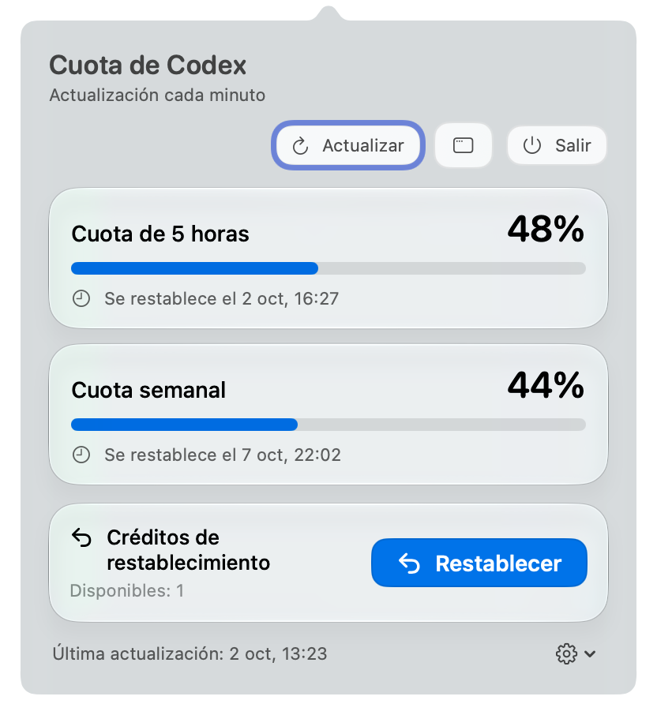
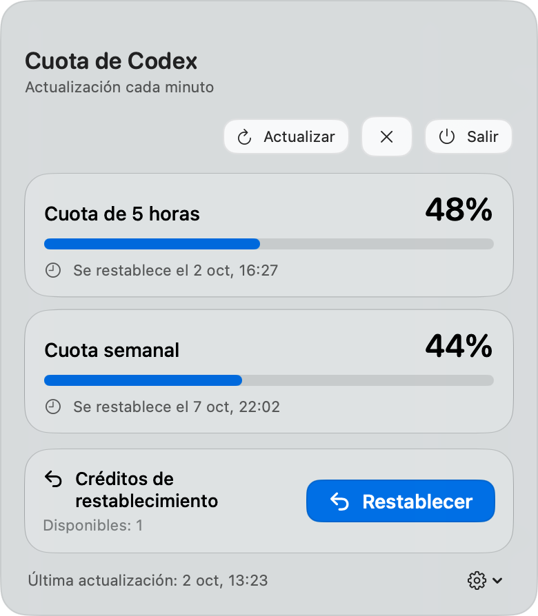

<p align="center"></p>

<h1 align="center">Cuota de Codex para macOS</h1>
<p align="center">Consulta la cuota de ChatGPT Codex casi en tiempo real: actualización automática cada minuto y manual cuando quieras.</p>
<p align="center">  </p>

<p align="center">🇬🇧 <a href="README.md">English</a> · 🇨🇳 <a href="README.zh-CN.md">简体中文</a> · 🇨🇳 <a href="README.zh-TW.md">繁體中文</a> · 🇷🇺 <a href="README.ru.md">Русский</a> · 🇫🇷 <a href="README.fr.md">Français</a> · 🇩🇪 <a href="README.de.md">Deutsch</a> · 🇮🇹 <a href="README.it.md">Italiano</a> · 🇯🇵 <a href="README.ja.md">日本語</a> · 🇰🇷 <a href="README.ko.md">한국어</a> · 🇵🇹 <a href="README.pt.md">Português</a> · 🇪🇸 <a href="README.es.md">Español</a></p>

## Descripción

Una aplicación ligera para la barra de menús de ChatGPT Codex. Consulta la cuota disponible, las oportunidades de restablecimiento y las horas de recuperación sin interrumpir tu trabajo.

## Capturas de pantalla

| Ventana emergente de la barra de menús | Ventana flotante |
| --- | --- |
|  |  |

La app sigue las preferencias de idioma de macOS.

## Funciones principales

| Área | Funciones |
| --- | --- |
| Barra de menús | Nudo monocromático de ChatGPT: completo al 100 %, se desvanece de arriba abajo a medida que disminuye la cuota de 5 horas |
| Icono de la app | Base blanca redondeada con un nudo de ChatGPT en gris grafito y un relleno monocromático que representa el nivel de cuota |
| Estado de la cuota | Barras de progreso para los límites de 5 horas y semanales, horas de recuperación y restablecimientos disponibles |
| Ventanas | Ventana emergente Liquid Glass en la barra de menús y ventana flotante independiente que puedes arrastrar |
| Actualización | Actualización automática cada minuto; confirmación antes de usar un restablecimiento |
| Inicio | Un agente local opcional abre la app de cuotas cuando se inicia ChatGPT |
| Idiomas | Sigue las preferencias de macOS: inglés, chino simplificado y tradicional, ruso, francés, alemán, italiano, japonés, coreano, portugués y español |

## Instalación

1. Primero instala la aplicación de escritorio ChatGPT e inicia sesión.
2. Descarga [CodexQuota-macOS.zip](https://github.com/jcxl8/codex-quota-macos/releases/latest/download/CodexQuota-macOS.zip).
3. En Finder, haz doble clic en el ZIP para extraer `CodexQuota.app`. Finder puede mostrar el nombre localizado, **Cuota de Codex**.
4. Arrastra la app extraída a la carpeta **Aplicaciones (Applications)** de Finder. Puedes abrir esa carpeta con **⌘⇧A**. Instálala antes de iniciarla; no la abras directamente desde Descargas ni desde la carpeta de extracción.
5. Abre la app desde **Aplicaciones**. El icono y el porcentaje aparecen en la barra de menús; es normal que no tenga un icono en el Dock.
6. Opcional: abre **Ajustes** en la app y activa **Abrir al iniciar ChatGPT**.

La app está firmada localmente y no está notarizada por Apple. Si macOS bloquea el primer inicio, abre **Ajustes del Sistema → Privacidad y seguridad**, busca el aviso de la app bloqueada, selecciona **Abrir igualmente** y confirma el siguiente mensaje. Usa este procedimiento únicamente para la app descargada de este repositorio.

Requiere macOS 13 o posterior. Liquid Glass está disponible a partir de macOS 26; las versiones anteriores utilizan el material del sistema.

### Instalar desde Terminal

Para una primera instalación en un Mac con Apple Silicon, pega este bloque en Terminal. Descarga la versión 1.4.2 de GitHub Releases, verifica su suma SHA-256 y la instala en Aplicaciones. Primero instala ChatGPT e inicia sesión.

```sh
(
  set -eu
  app_target="/Applications/CodexQuota.app"
  if [ -e "$app_target" ] || [ -L "$app_target" ]; then
    printf '%s\n' 'Ya está instalada. Cierra la app y sigue los pasos de Finder anteriores para sustituir la versión antigua.' >&2
    exit 1
  fi
  download_dir="$(mktemp -d)"
  cd "$download_dir"
  curl -fL --retry 3 -O 'https://github.com/jcxl8/codex-quota-macos/releases/download/v1.4.2/CodexQuota-macOS.zip'
  curl -fL --retry 3 -O 'https://github.com/jcxl8/codex-quota-macos/releases/download/v1.4.2/CodexQuota-macOS.zip.sha256'
  shasum -a 256 -c CodexQuota-macOS.zip.sha256
  ditto -x -k CodexQuota-macOS.zip .
  ditto CodexQuota.app "$app_target"
  printf '%s\n' 'Instalación completada. Abre CodexQuota.app desde Aplicaciones.'
)
```

Después de instalarla, abre la app desde Aplicaciones. Se aplican las instrucciones de seguridad del primer inicio indicadas arriba. Este paquete admite Apple Silicon (arm64), no Macs Intel.

## Compilación

La compilación requiere Xcode 26 o posterior y su compilador de Icon Composer. Se necesitan macOS y Swift 5.9 o posterior. Ejecuta el script de compilación incluido desde Terminal para crear la app y ejecutar sus comprobaciones integradas.

## Privacidad

La app lee los datos de cuota del Codex CLI incluido en la aplicación de escritorio ChatGPT. No recopila ni sube datos, no guarda tokens de acceso y no envía solicitudes a modelos. Solo consume un restablecimiento después de seleccionar Restablecer y confirmar. ChatGPT debe estar instalado y con la sesión iniciada. La app está firmada localmente y no está notarizada por Apple.
