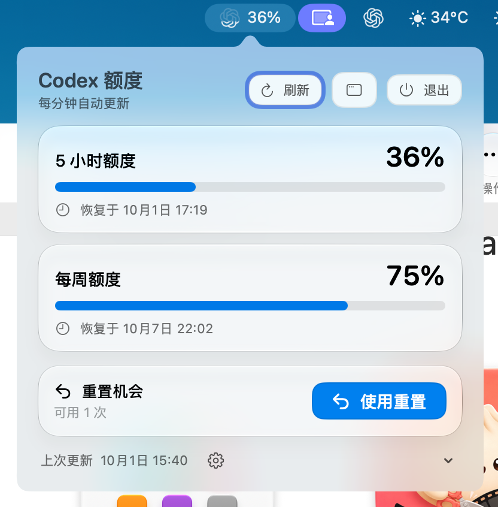
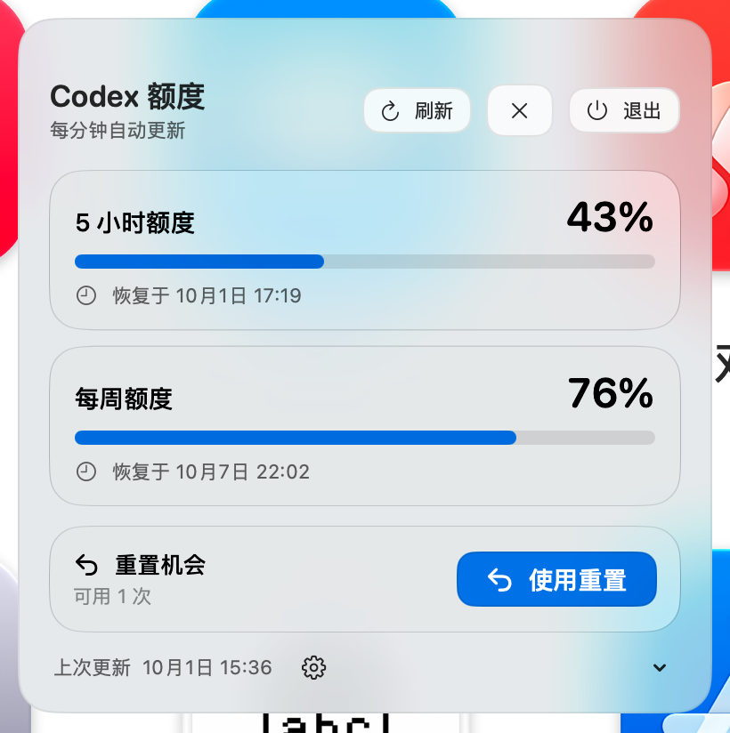

<h1 align="center">Лимиты Codex для macOS</h1>

Отслеживайте лимиты ChatGPT Codex почти в реальном времени: автоматическое обновление каждую минуту и ручное в любой момент.

  

🇬🇧 <a href="README.md">English</a> · 🇨🇳 <a href="README.zh-CN.md">简体中文</a> · 🇨🇳 <a href="README.zh-TW.md">繁體中文</a> · 🇷🇺 <a href="README.ru.md">Русский</a> · 🇫🇷 <a href="README.fr.md">Français</a> · 🇩🇪 <a href="README.de.md">Deutsch</a> · 🇮🇹 <a href="README.it.md">Italiano</a> · 🇯🇵 <a href="README.ja.md">日本語</a> · 🇰🇷 <a href="README.ko.md">한국어</a> · 🇵🇹 <a href="README.pt.md">Português</a> · 🇪🇸 <a href="README.es.md">Español</a>

## Обзор

Лёгкое приложение для строки меню ChatGPT Codex. Проверяйте доступные лимиты, попытки сброса и время восстановления, не прерывая работу.

## Скриншоты

| Окно в строке меню | Плавающее окно |
| --- | --- |
|  |  |

На скриншотах показан интерфейс на упрощённом китайском. Приложение использует языковые настройки macOS.

## Основные возможности

| Раздел | Возможности |
| --- | --- |
| Строка меню | Монохромный узел ChatGPT: полный при 100 %, бледнеет сверху вниз по мере уменьшения 5-часового лимита |
| Значок приложения | Белая скруглённая плитка с графитовым узлом ChatGPT и монохромным эффектом уровня заполнения |
| Состояние лимитов | Индикаторы для лимитов на 5 часов и неделю, время восстановления и доступные попытки сброса |
| Окна | Всплывающее окно Liquid Glass и отдельное перемещаемое окно |
| Обновление | Автоматическое обновление каждую минуту; подтверждение перед сбросом |
| Запуск | Необязательный локальный агент открывает приложение при запуске ChatGPT |
| Языки | Язык macOS: английский, упрощённый и традиционный китайский, русский, французский, немецкий, итальянский, японский, корейский, португальский и испанский |

## Установка

1. Сначала установите настольное приложение ChatGPT и войдите в аккаунт.
2. Скачайте [CodexQuota-macOS.zip](https://github.com/jcxl8/codex-quota-macos/raw/refs/heads/main/CodexQuota-macOS.zip).
3. В Finder дважды нажмите ZIP-файл, чтобы распаковать `CodexQuota.app`. Finder может показать локализованное название приложения.
4. Перетащите распакованное приложение в папку **Программы (Applications)** в Finder. Открыть её можно сочетанием **⌘⇧A**. Сначала установите приложение, затем запускайте; не открывайте его прямо из «Загрузок» или папки распаковки.
5. Откройте приложение из **Программ**. Значок и процент появятся в строке меню; отсутствие значка в Dock нормально.
6. По желанию откройте **Настройки** приложения и включите **Открывать при запуске ChatGPT**.

Приложение подписано локально и не нотарифицировано Apple. Если macOS блокирует первый запуск, откройте **Системные настройки → Конфиденциальность и безопасность**, найдите уведомление о блокировке приложения, нажмите **Всё равно открыть** и подтвердите действие. Используйте эту процедуру только для приложения, скачанного из этого репозитория.

Требуется macOS 13 или новее. Liquid Glass доступен в macOS 26 и новее; более ранние версии используют системный материал.

## Сборка

Для сборки необходимы Xcode 26 или новее и его компилятор Icon Composer. Требуются macOS и Swift 5.9 или новее. Запустите приложенный сценарий сборки в Терминале, чтобы создать приложение и выполнить встроенные проверки.

## Конфиденциальность

Приложение читает данные о лимитах из Codex CLI, входящего в настольное приложение ChatGPT. Оно не собирает и не отправляет данные, не сохраняет токены доступа и не отправляет запросы к моделям. Попытка сброса расходуется только после выбора соответствующего действия и подтверждения. Необходимо установить ChatGPT и войти в аккаунт. Приложение подписано локально и не нотарифицировано Apple.
